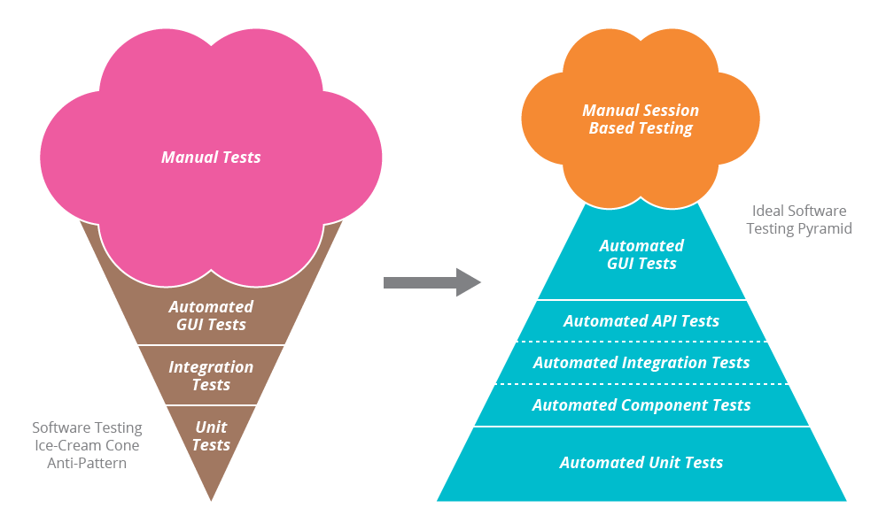
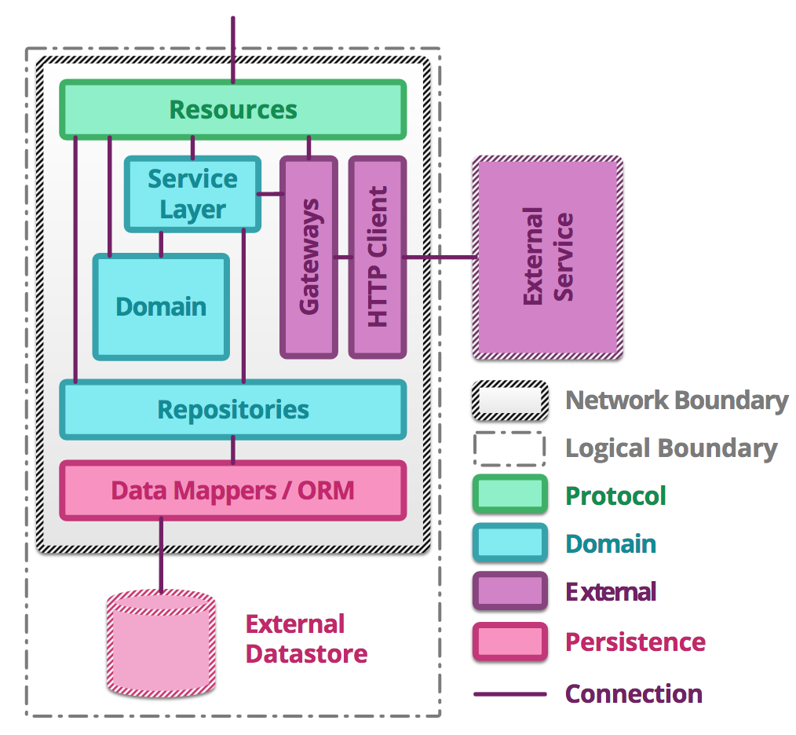
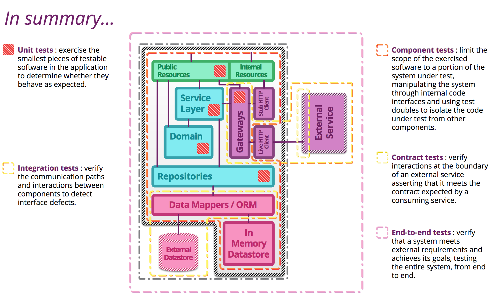

# microservices-testing

how to test microservices based applications?

> There has been a shift in service based architectures over the last few years towards smaller, more focussed "micro" services. There are many benefits with this approach such as the ability to independently deploy, scale and maintain each component and parallelize development across multiple teams. However, once these additional network partitions have been introduced, the testing strategies that applied for monolithic in process applications need to be reconsidered.

Unit tests are fast to execute, give the right level of feedback about what is broken. As you go up the pyramid, the tests are slower and it becomes harder to point out root cause of failures because the surface area is larger.

Its essential point is that you should have many more low-level unit tests than high level end-to-end tests running through a GUI.

A common problem is that teams conflate the concepts of end-to-end tests, UI tests, and customer facing tests. These are all orthogonal characteristics. For example a rich javascript UI should have most of its UI behavior tested with javascript unit tests using something like Jasmine. A complex set of business rules could have tests captured in a customer-facing form, but run just on the relevant module much as unit tests are.

> I always argue that high-level tests are there as a second line of test defense. If you get a failure in a high level test, not just do you have a bug in your functional code, you also have a missing or incorrect unit test. Thus I advise that before fixing a bug exposed by a high level test, you should replicate the bug with a unit test. Then the unit test ensures the bug stays dead.

# Microservices can usually be split into similar kinds of modules

* **Resources** act as mappers between the application protocol exposed by the service and messages to objects representing the domain. Typically, they are thin, with responsibility for sanity checking the request and providing a protocol specific response according to the outcome of the business transaction.

* Almost all of the service logic resides in a **domain model** representing the business domain. Of these objects, **services** coordinate across multiple domain activities, whilst **repositories** act on collections of domain entities and are often persistence backed.

* If one service has another service as a collaborator, some logic is needed to communicate with the external service. A gateway encapsulates message passing with a remote service, marshalling requests and responses from and to domain objects. It will likely use a client that understands the underlying protocol to handle the request-response cycle.

* Except in the most trivial cases or when a service acts as an aggregator across resources owned by other services, a micro-service will need to be able to persist objects from the domain between requests. Usually this is achieved using object relation mapping or more lightweight data mappers depending on the complexity of the persistence requirements. Often, this logic is encapsulated in a set of dedicated objects utilised by repositories from the domain.

* A resource receives a request and once validated, calls into the domain to begin handling of the request.

* If many modules must be coordinated to complete the business transaction, the resource delegates to a service. Otherwise, it communicates directly with the relevant module.

* Connections out to external services require special attention since they cross network boundaries. The system should be resilient to outages of remote components. Gateways contain logic to handle such error cases. Typically, communications with external services are more coarse grained than the equivalent in process communications to prevent API chattiness and latency.
  
* Similarly, communications with external datastores have different design considerations. Whilst a service is often more logically coupled to its datastore than to an external service, the datastore still exists over a network boundary incurring latency and risk of outage.
  
* The presence of network partitions affects the style of testing employed. Tests of these modules can have longer execution times and may fail for reasons outside of the team's control.

### Internal Resources 

are useful for more than just testing...

Though it may seem strange, exposing internal controls as resources can prove useful in a number of cases besides testing such as monitoring, maintenance and debugging. The uniformity of a RESTful API means that many tools already exist for interacting with such resources which can help reduce overall operational complexity.

The kinds of internal resources that are typically exposed include logs, feature flags, database commands and system metrics. Many microservices also include health check resources which provide information about the health of the service and its dependencies, timings for key transactions and details of configuration parameters. A simple ping resource can also be useful to aid in load balancing.

Since these resources are more privileged in terms of the control they have or the information they expose, they often require their own authentication or to be locked down at the network level. By namespacing those parts of the API that form the internal controls using URL naming conventions or by exposing those resources on a different network port, access can be restricted at the firewall level.

# Testing Strategies for Microservices

## Unit Tests

Unit tests : exercise the smallest pieces of testable software in the application to determine whether they behave as expected.

## Integration Tests

Integration tests : verify the communication paths and interactions between components to detect interface defects.

### Gateway Integration Tests

### Persistence Integration Tests

## Component tests

limit the scope of the exercised software to a portion of the system under test, manipulating the system through internal code interfaces and using test doubles to isolate the code under test from other components.

### In Process

### Out Process

## Contract tests

Verify interactions at the boundary of an external service asserting that it meets the contract expected by a consuming service.

### Consumer Driven Contracts
  
It's nearly impossible for you to know all the ways consumers might use your services. With a [consumer-driven contract](http://martinfowler.com/articles/consumerDrivenContracts.html) model, it's the consumer's responsibility to provide a suite of tests that specify what types of interactions are needed and in which format. Your service would then agree to this contract and ensure that it's not broken. This gets rid of dependencies on other services. This approach also enables you to verify that the contract is being fulfilled at build time.

Tools like [Pact](https://github.com/realestate-com-au/pact) will give you a better understanding of how you can achieve this type of functionality for developing and testing microservices. Once you have a consumer-driven contract process in place, the next key step in testing microservices is to shift-right into the previously forbidden world of production.

## End-to-end tests

verify that a system meets external requirements and achieves its goals, testing the entire system, from end to end.

## Synthetic Transactions (Tests running production)

# References

* https://martinfowler.com/articles/microservice-testing/
* https://www.thoughtworks.com/insights/blog/architecting-continuous-delivery
